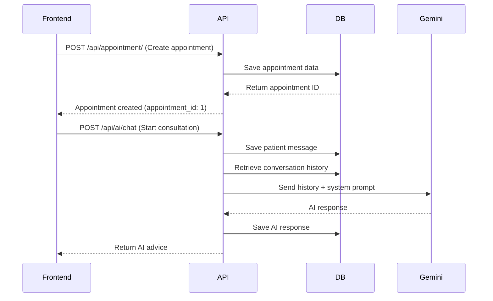

# 🩺 Med It Easy API Analysis Report

## 📋 Project Overview

**Med It Easy** is an AI-powered clinical decision support system designed to streamline the interaction between patients and doctors.

**Key Objectives:**
- Provide an interactive patient interface for easy appointment scheduling and symptom description via AI chatbot
- Offer doctors structured medical summaries and preliminary disease predictions
- Enhance efficiency and quality of healthcare services

---

## 🏗️ Technical Architecture

### Backend Tech Stack
- **Framework:** FastAPI (0.121.2)
- **Database:** SQLite with SQLModel ORM (0.0.27)
- **AI Model:** Google Gemini 2.0 Flash
- **Web Server:** Uvicorn (0.38.0)
- **Other Dependencies:**
  - `google-generativeai` (0.8.5) - AI conversation functionality
  - `python-dotenv` (1.2.1) - Environment variable management

### Project Structure
```
med-it-easy/
├── app/
│   ├── __init__.py
│   ├── main.py           # FastAPI application entry point
│   ├── database.py       # Database connection configuration
│   ├── models.py         # SQLModel data models
│   └── routers/
│       ├── __init__.py
│       ├── ai.py         # AI consultation routes
│       └── appointment.py # Appointment system routes
├── pyproject.toml        # Project dependencies
├── uv.lock              # Locked dependency versions
├── .env                 # Environment variables (create manually)
└── README.md            # Project documentation
```

---

## 🗄️ Database Models

### 1. User
Stores system users (Patients, Doctors, Admins)

**Fields:**
- `id`: Primary key
- `username`: Unique username (indexed)
- `password_hash`: Hashed password
- `full_name`: Full name
- `role`: Role (PATIENT/DOCTOR/ADMIN)
- `department`: Department (for doctors only)
- `created_at`: Creation timestamp

**Relationships:**
- `doctor_appointments`: Appointments as doctor
- `patient_appointments`: Appointments as patient

### 2. Appointment
Core scheduling entity linking patients and doctors

**Fields:**
- `id`: Primary key
- `patient_id`: Patient ID (FK → users.id)
- `doctor_id`: Doctor ID (FK → users.id)
- `date`: Appointment date (Format: YYYY-MM-DD)
- `time`: Appointment time (Format: HH:MM)
- `department`: Department
- `status`: Status (PENDING/COMPLETED/CANCELLED)
- `created_at`: Creation timestamp

**Relationships:**
- `patient`: Link to User (patient)
- `doctor`: Link to User (doctor)
- `symptoms`: List of symptom logs
- `medical_record`: Medical record (one-to-one)

### 3. SymptomLog
Stores AI interview chat history and symptom descriptions

**Fields:**
- `id`: Primary key
- `appointment_id`: Appointment ID (FK → appointments.id)
- `sender_role`: Sender role ('patient' or 'ai')
- `content`: Message content (Text type)
- `created_at`: Creation timestamp

**Relationships:**
- `appointment`: Link to Appointment

### 4. MedicalRecord
Stores AI analysis results and doctor's final diagnosis

**Fields:**
- `id`: Primary key
- `appointment_id`: Appointment ID (FK → appointments.id, unique)
- `ai_summary`: AI-generated summary (Text, optional)
- `ai_disease_prediction`: AI disease prediction (Text, optional)
- `doctor_diagnosis`: Doctor's diagnosis (Text, optional)
- `prescription`: Prescription (Text, optional)
- `created_at`: Creation timestamp
- `updated_at`: Update timestamp

**Relationships:**
- `appointment`: Link to Appointment

---

## 🔌 API Endpoints

### Base Endpoint

#### GET /
**Function:** Check service status

**Response:**
```json
{
  "message": "Med It Easy Backend is running!"
}
```

---

### Appointment System (/api/appointment)

#### 1. POST /api/appointment/
**Function:** Create a new appointment

**Request Body:**
```json
{
  "patient_id": 1,
  "doctor_id": 2,
  "date": "2024-12-01",
  "time": "14:30",
  "department": "Internal Medicine"
}
```

**Response:** Complete Appointment object (including auto-generated id, status, created_at)

**Status:** ✅ Implemented

---

#### 2. GET /api/appointment/
**Function:** Retrieve all appointments

**Response:**
```json
[
  {
    "id": 1,
    "patient_id": 1,
    "doctor_id": 2,
    "date": "2024-12-01",
    "time": "14:30",
    "department": "Internal Medicine",
    "status": "pending",
    "created_at": "2024-11-19T08:00:00"
  }
]
```

**Status:** ✅ Implemented

---

#### 3. GET /api/appointment/doctor/{doctor_name}
**Function:** Query a specific doctor's schedule

**Parameters:**
- `doctor_name` (path): Doctor's name

**⚠️ Issue:** This endpoint has a bug!
- Code uses `Appointment.doctor` field, but this field doesn't exist in the Appointment model
- Should use relationship query or `doctor_id` instead

**Status:** ⚠️ Implemented but has errors

**Suggested Fix:**
```python
# Should be changed to:
statement = select(Appointment).join(User).where(User.full_name == doctor_name)
```

---

### AI Consultation (/api/ai)

#### POST /api/ai/chat
**Function:** Chat with AI assistant for symptom analysis and recommendations

**Request Body:**
```json
{
  "appointment_id": 1,
  "message": "I've been having headaches and a slight fever recently"
}
```

**Processing Flow:**
1. Verify appointment exists
2. Save user message to SymptomLog (sender_role: "patient")
3. Retrieve complete conversation history from database
4. Convert history to Gemini API format (patient → user, ai → model)
5. Construct complete prompt with system instructions
6. Call Google Gemini 2.0 Flash model
7. Save AI response to SymptomLog (sender_role: "ai")
8. Return AI response

**AI System Prompt:**
```
You are an AI assistant for a medical consultation project.
Based on user symptom descriptions and conversation history, perform these tasks:

1. [Disease Diagnosis]: Infer possible disease names (write "Under Observation" if insufficient info)
2. [Give Advice]: Provide brief care suggestions or medical guidance. If you haven't successfully 
   identified the disease, don't give advice yet - ask the user more questions to determine the cause.

⚠️ Important Response Format:
You must use "###SEGMENT###" to separate disease name from advice.
Format:
[Disease Name]###SEGMENT###[Friendly advice to user]

Example:
Common Cold###SEGMENT###Suggest drinking plenty of warm water and getting rest...
```

**Response:**
```json
{
  "reply": "Common Cold###SEGMENT###Suggest drinking plenty of warm water and getting rest. If symptoms persist beyond 3 days or worsen, please seek medical attention promptly."
}
```

**Error Handling:**
- 404: Appointment not found
- 500: AI call or database operation failed

**Status:** ✅ Implemented

---

## 🔧 Middleware & Configuration

### CORS Settings
```python
app.add_middleware(
    CORSMiddleware,
    allow_origins=["*"],  # Allow all origins (development phase)
    allow_credentials=True,
    allow_methods=["*"],
    allow_headers=["*"],
)
```

**⚠️ Security Recommendation:** Production should limit `allow_origins` to specific domains

### Lifecycle Management
- **On Startup:** Automatically creates database tables
- **On Shutdown:** Graceful shutdown (currently only prints message)

---

## 📊 Data Flow Example

### Complete Appointment & Consultation Flow



---

## ✅ Implemented Features Summary

1. **✅ Appointment Management System**
   - Create appointments
   - Query all appointments
   - Query doctor schedules (has bug)

2. **✅ AI Consultation System**
   - Intelligent conversation functionality
   - Conversation history tracking
   - Disease prediction and recommendations
   - Google Gemini integration

3. **✅ Database Architecture**
   - Complete relational data models
   - User management (patients, doctors, admins)
   - Appointment records
   - Symptom logs
   - Medical records

4. **✅ Infrastructure**
   - FastAPI framework
   - CORS support
   - SQLModel ORM
   - Lifecycle management

---

## ⚠️ Areas for Improvement

### High Priority

1. **🔴 Fix Doctor Schedule Query Bug**
   - Current `/api/appointment/doctor/{doctor_name}` endpoint doesn't work properly
   - Need to modify query logic to use correct relationships

2. **🔴 Missing User Authentication & Authorization**
   - No login/logout functionality
   - No JWT or Session management
   - All endpoints are public with no access control

3. **🔴 Missing Medical Record CRUD Endpoints**
   - MedicalRecord model is defined but has no corresponding APIs
   - Doctors cannot add/query diagnoses and prescriptions

### Medium Priority

4. **🟡 Missing Input Validation**
   - Date format validation
   - Time format validation
   - Department option validation

5. **🟡 Missing Unit Tests**
   - No test files
   - Cannot ensure code quality

6. **🟡 Incomplete Error Handling**
   - Missing unified error response format
   - Missing detailed error messages

7. **🟡 Missing Pagination**
   - GET /api/appointment/ has no pagination
   - May cause performance issues with large datasets

### Low Priority

8. **🟢 Missing API Documentation**
   - While Swagger Docs exist, lacks detailed descriptions
   - Missing usage examples

9. **🟢 Incomplete Environment Configuration**
   - CORS settings too permissive (production risk)
   - Missing database connection pool configuration
   - Missing logging configuration

10. **🟢 Missing Database Migration Tools**
    - Not using Alembic
    - Cannot track database schema changes

---

## 🚀 Suggested Development Roadmap

### Phase 1: Fix & Complete Core Features
- [ ] Fix doctor schedule query bug
- [ ] Add user authentication system (JWT)
- [ ] Add medical record CRUD endpoints
- [ ] Improve error handling

### Phase 2: Enhance Quality & Security
- [ ] Add input validation
- [ ] Establish unit testing framework
- [ ] Implement access control (RBAC)
- [ ] Strengthen CORS settings

### Phase 3: Expand Functionality
- [ ] Add pagination
- [ ] Add search & filtering
- [ ] Add notification system
- [ ] Add file upload (medical images)

### Phase 4: Production Readiness
- [ ] Add database migration tools
- [ ] Add logging system
- [ ] Add monitoring & tracing
- [ ] Performance optimization

---

## 📝 Conclusion

The Med It Easy project has established a **solid foundation** with core appointment system and AI consultation features already implemented. The database model design is comprehensive and considers future extensibility.

**Main Strengths:**
- ✅ Clear project structure
- ✅ Complete data model design
- ✅ Well-integrated AI functionality
- ✅ Conversation history support

**Areas Needing Improvement:**
- ⚠️ Security (authentication & authorization)
- ⚠️ Code quality (testing, validation)
- ⚠️ Feature completeness (medical record APIs)

**Overall Assessment:** This is a good MVP (Minimum Viable Product) suitable for demonstration or further development. Before production deployment, priority should be given to security and authentication-related improvements.

---

## 📚 Related Resources

- **FastAPI Documentation:** https://fastapi.tiangolo.com/
- **SQLModel Documentation:** https://sqlmodel.tiangolo.com/
- **Google Gemini API:** https://ai.google.dev/docs
- **Swagger UI:** http://localhost:8000/docs (accessible after starting service)

---

*Report Generated: 2024-11-19*
*Analyst: GitHub Copilot*
