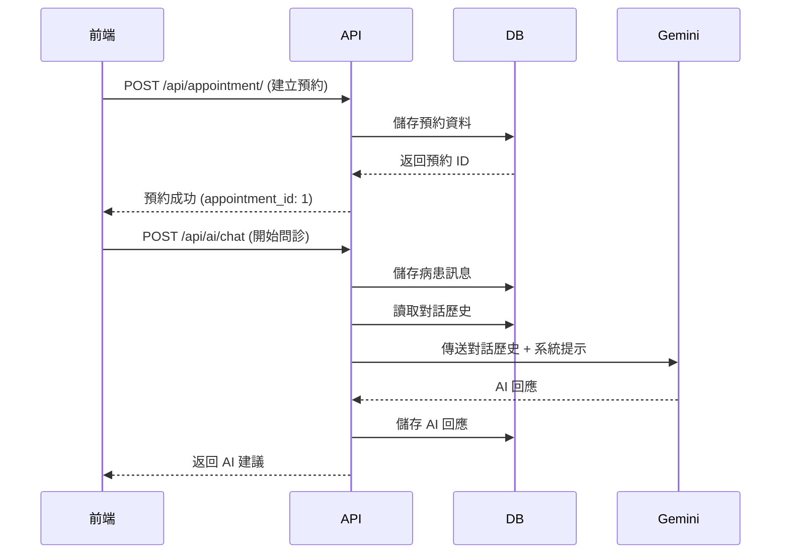

# 🩺 Med It Easy API 分析報告

## 📋 專案概述

**Med It Easy** 是一個 AI 驅動的臨床決策支援系統，旨在簡化病患與醫生之間的互動流程。

**主要目標：**
- 提供互動式病患介面，讓使用者能輕鬆預約並透過 AI 聊天機器人描述症狀
- 為醫生提供結構化的醫療摘要與初步疾病預測
- 提升醫療服務效率與品質

---

## 🏗️ 技術架構

### 後端技術棧
- **框架：** FastAPI (0.121.2)
- **資料庫：** SQLite with SQLModel ORM (0.0.27)
- **AI 模型：** Google Gemini 2.0 Flash
- **Web 伺服器：** Uvicorn (0.38.0)
- **其他依賴：**
  - `google-generativeai` (0.8.5) - AI 對話功能
  - `python-dotenv` (1.2.1) - 環境變數管理

### 專案結構
```
med-it-easy/
├── app/
│   ├── __init__.py
│   ├── main.py           # FastAPI 應用程式主檔案
│   ├── database.py       # 資料庫連接設定
│   ├── models.py         # SQLModel 資料模型
│   └── routers/
│       ├── __init__.py
│       ├── ai.py         # AI 問診相關路由
│       └── appointment.py # 預約系統相關路由
├── pyproject.toml        # 專案依賴配置
├── uv.lock              # 鎖定的依賴版本
├── .env                 # 環境變數（需自行創建）
└── README.md            # 專案說明
```

---

## 🗄️ 資料庫模型

### 1. User（使用者）
儲存系統使用者資訊（病患、醫生、管理員）

**欄位：**
- `id`: 主鍵
- `username`: 使用者名稱（唯一、有索引）
- `password_hash`: 密碼雜湊值
- `full_name`: 全名
- `role`: 角色（PATIENT/DOCTOR/ADMIN）
- `department`: 科別（僅醫生需要）
- `created_at`: 建立時間

**關聯：**
- `doctor_appointments`: 作為醫生的預約清單
- `patient_appointments`: 作為病患的預約清單

### 2. Appointment（預約）
核心預約實體，連接病患與醫生

**欄位：**
- `id`: 主鍵
- `patient_id`: 病患 ID（外鍵 → users.id）
- `doctor_id`: 醫生 ID（外鍵 → users.id）
- `date`: 預約日期（格式：YYYY-MM-DD）
- `time`: 預約時間（格式：HH:MM）
- `department`: 科別
- `status`: 狀態（PENDING/COMPLETED/CANCELLED）
- `created_at`: 建立時間

**關聯：**
- `patient`: 關聯到 User（病患）
- `doctor`: 關聯到 User（醫生）
- `symptoms`: 症狀對話記錄清單
- `medical_record`: 醫療記錄（一對一）

### 3. SymptomLog（症狀記錄）
儲存 AI 問診的對話歷史與症狀描述

**欄位：**
- `id`: 主鍵
- `appointment_id`: 預約 ID（外鍵 → appointments.id）
- `sender_role`: 發送者角色（'patient' 或 'ai'）
- `content`: 對話內容（Text 類型）
- `created_at`: 建立時間

**關聯：**
- `appointment`: 關聯到 Appointment

### 4. MedicalRecord（醫療記錄）
儲存 AI 分析結果與醫生最終診斷

**欄位：**
- `id`: 主鍵
- `appointment_id`: 預約 ID（外鍵 → appointments.id，唯一）
- `ai_summary`: AI 生成的摘要（Text 類型，可選）
- `ai_disease_prediction`: AI 疾病預測（Text 類型，可選）
- `doctor_diagnosis`: 醫生診斷（Text 類型，可選）
- `prescription`: 處方（Text 類型，可選）
- `created_at`: 建立時間
- `updated_at`: 更新時間

**關聯：**
- `appointment`: 關聯到 Appointment

---

## 🔌 API 端點

### 基礎端點

#### GET /
**功能：** 檢查服務狀態

**回應：**
```json
{
  "message": "Med It Easy Backend is running!"
}
```

---

### 預約系統 (/api/appointment)

#### 1. POST /api/appointment/
**功能：** 創建新的預約

**請求 Body：**
```json
{
  "patient_id": 1,
  "doctor_id": 2,
  "date": "2024-12-01",
  "time": "14:30",
  "department": "內科"
}
```

**回應：** 完整的 Appointment 物件（包含自動產生的 id、status、created_at）

**狀態：** ✅ 已實作

---

#### 2. GET /api/appointment/
**功能：** 獲取所有預約記錄

**回應：**
```json
[
  {
    "id": 1,
    "patient_id": 1,
    "doctor_id": 2,
    "date": "2024-12-01",
    "time": "14:30",
    "department": "內科",
    "status": "pending",
    "created_at": "2024-11-19T08:00:00"
  }
]
```

**狀態：** ✅ 已實作

---

#### 3. GET /api/appointment/doctor/{doctor_name}
**功能：** 查詢特定醫生的排程

**參數：**
- `doctor_name` (path): 醫生名稱

**⚠️ 問題：** 此端點有 bug！
- 程式碼使用 `Appointment.doctor` 欄位，但實際上 Appointment 模型沒有此欄位
- 應該改用關聯查詢或使用 `doctor_id`

**狀態：** ⚠️ 已實作但有錯誤

**建議修正：**
```python
# 應該改為：
statement = select(Appointment).join(User).where(User.full_name == doctor_name)
```

---

### AI 問診 (/api/ai)

#### POST /api/ai/chat
**功能：** 與 AI 助手進行對話，獲取症狀分析與建議

**請求 Body：**
```json
{
  "appointment_id": 1,
  "message": "我最近一直頭痛，而且有點發燒"
}
```

**處理流程：**
1. 驗證預約是否存在
2. 將使用者訊息儲存到 SymptomLog（sender_role: "patient"）
3. 從資料庫讀取完整對話歷史
4. 將歷史記錄轉換為 Gemini API 格式（patient → user, ai → model）
5. 構建包含系統提示的完整提示詞
6. 呼叫 Google Gemini 2.0 Flash 模型
7. 儲存 AI 回應到 SymptomLog（sender_role: "ai"）
8. 返回 AI 回應

**AI 系統提示：**
```
你現在是一個醫療問診專案的 AI 助手。
請根據使用者的症狀描述與對話歷史，執行以下任務：

1. 【判斷疾病】：推測可能的疾病名稱（若資訊不足可寫「待觀察」）。
2. 【給予建議】：提供簡短的護理建議或就醫指引，如果你還未成功判斷出疾病，
   請不要給予建議，問使用者其他問題以達到判斷病因的目的。

⚠️ 重要回覆格式規定：
請務必使用 "###SEGMENT###" 符號將疾病名稱與建議分開。
格式如下：
[疾病名稱]###SEGMENT###[給使用者的親切建議]

範例：
感冒###SEGMENT###建議多喝溫開水，並多休息。...
```

**回應：**
```json
{
  "reply": "感冒###SEGMENT###建議多喝溫開水，並多休息。如果症狀持續超過3天或惡化，請盡快就醫。"
}
```

**錯誤處理：**
- 404: 找不到預約記錄
- 500: AI 呼叫或資料庫操作失敗

**狀態：** ✅ 已實作

---

## 🔧 中間件與設定

### CORS 設定
```python
app.add_middleware(
    CORSMiddleware,
    allow_origins=["*"],  # 允許所有來源（開發階段）
    allow_credentials=True,
    allow_methods=["*"],
    allow_headers=["*"],
)
```

**⚠️ 安全建議：** 生產環境應限制 `allow_origins` 為特定網域

### 生命週期管理
- **啟動時：** 自動創建資料庫表格
- **關閉時：** 優雅關閉（目前僅打印訊息）

---

## 📊 資料流範例

### 完整的預約與問診流程



---

## ✅ 已實作功能總結

1. **✅ 預約管理系統**
   - 創建預約
   - 查詢所有預約
   - 查詢醫生排程（有 bug）

2. **✅ AI 問診系統**
   - 智能對話功能
   - 對話歷史記錄
   - 疾病預測與建議
   - Google Gemini 整合

3. **✅ 資料庫架構**
   - 完整的關聯式資料模型
   - 使用者管理（病患、醫生、管理員）
   - 預約記錄
   - 症狀記錄
   - 醫療記錄

4. **✅ 基礎設施**
   - FastAPI 框架
   - CORS 支援
   - SQLModel ORM
   - 生命週期管理

---

## ⚠️ 待改進項目

### 高優先級

1. **🔴 修復醫生排程查詢 Bug**
   - 目前的 `/api/appointment/doctor/{doctor_name}` 端點無法正常運作
   - 需要修改查詢邏輯以使用正確的關聯

2. **🔴 缺少使用者認證與授權**
   - 沒有登入/登出功能
   - 沒有 JWT 或 Session 管理
   - 所有端點都是公開的，沒有權限控制

3. **🔴 缺少醫療記錄 CRUD 端點**
   - MedicalRecord 模型已定義但沒有相應的 API
   - 醫生無法新增/查詢診斷與處方

### 中優先級

4. **🟡 缺少輸入驗證**
   - 日期格式驗證
   - 時間格式驗證
   - 科別選項驗證

5. **🟡 缺少單元測試**
   - 沒有任何測試檔案
   - 無法確保程式碼品質

6. **🟡 錯誤處理不完整**
   - 缺少統一的錯誤回應格式
   - 缺少詳細的錯誤訊息

7. **🟡 缺少分頁功能**
   - GET /api/appointment/ 沒有分頁
   - 大量資料時可能造成效能問題

### 低優先級

8. **🟢 缺少 API 文檔**
   - 雖然有 Swagger Docs，但沒有中文說明
   - 缺少使用範例

9. **🟢 環境配置不完整**
   - CORS 設定過於寬鬆（生產環境風險）
   - 缺少資料庫連接池配置
   - 缺少日誌設定

10. **🟢 缺少資料庫遷移工具**
    - 沒有使用 Alembic
    - 無法追蹤資料庫結構變更

---

## 🚀 建議的開發路線圖

### Phase 1: 修復與完善核心功能
- [ ] 修復醫生排程查詢 bug
- [ ] 新增使用者認證系統（JWT）
- [ ] 新增醫療記錄 CRUD 端點
- [ ] 改善錯誤處理

### Phase 2: 提升品質與安全
- [ ] 新增輸入驗證
- [ ] 建立單元測試框架
- [ ] 實作權限控制（RBAC）
- [ ] 強化 CORS 設定

### Phase 3: 擴充功能
- [ ] 新增分頁功能
- [ ] 新增搜尋與篩選
- [ ] 新增通知系統
- [ ] 新增檔案上傳（醫療影像）

### Phase 4: 生產準備
- [ ] 新增資料庫遷移工具
- [ ] 新增日誌系統
- [ ] 新增監控與追蹤
- [ ] 效能優化

---

## 📝 結論

Med It Easy 專案已經建立了一個**堅實的基礎架構**，核心的預約系統與 AI 問診功能都已經實作。資料庫模型設計完整，且考慮到了未來的擴展性。

**主要優點：**
- ✅ 清晰的專案結構
- ✅ 完整的資料模型設計
- ✅ AI 整合完善
- ✅ 支援對話歷史記錄

**需要改進：**
- ⚠️ 安全性（認證授權）
- ⚠️ 程式碼品質（測試、驗證）
- ⚠️ 功能完整性（醫療記錄 API）

**總體評估：** 這是一個良好的 MVP（最小可行產品），適合作為展示或進一步開發的基礎。在投入生產環境之前，建議優先處理安全性與認證相關的改進項目。

---

## 📚 相關資源

- **FastAPI 文檔：** https://fastapi.tiangolo.com/
- **SQLModel 文檔：** https://sqlmodel.tiangolo.com/
- **Google Gemini API：** https://ai.google.dev/docs
- **Swagger UI：** http://localhost:8000/docs （啟動服務後可訪問）

---

*報告生成時間：2024-11-19*
*分析者：GitHub Copilot*
